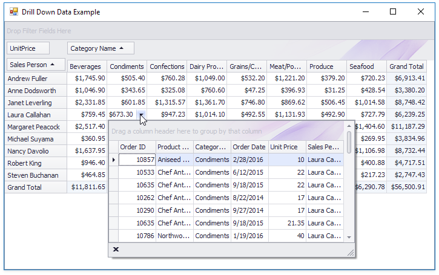

<!-- default badges list -->

<!-- default badges end -->
<!-- default file list -->
*Files to look at*:

* [DrillDownControl.cs](./CS/PivotGridDrillDownDataExample/DrillDownControl.cs) (VB: [DrillDownControl.vb](./VB/PivotGridDrillDownDataExample/DrillDownControl.vb))
* [Form1.cs](./CS/PivotGridDrillDownDataExample/Form1.cs) (VB: [Form1.vb](./VB/PivotGridDrillDownDataExample/Form1.vb))
<!-- default file list end -->
# How to Show Drill Down Data in the Popup Window

This example demonstrates how to display drill-down data in the window invoked when the user clicks the cell in the data area. 

API in this example:

* [PivotGridCells.GetFocusedCellInfo](https://docs.devexpress.com/WindowsForms/DevExpress.XtraPivotGrid.PivotGridCells.GetFocusedCellInfo) method
* [PivotCellEventArgs.CreateDrillDownDataSource](https://docs.devexpress.com/CoreLibraries/DevExpress.XtraPivotGrid.PivotCellEventArgsBase-3.CreateDrillDownDataSource) method
* [PivotGridField.FieldEdit](https://docs.devexpress.com/WindowsForms/DevExpress.XtraPivotGrid.PivotGridField.FieldEdit) property
* [RepositoryItemPopupContainerEdit.QueryPopUp](https://docs.devexpress.com/WindowsForms/DevExpress.XtraEditors.Repository.RepositoryItemPopupBase.QueryPopUp) event
* [RepositoryItemPopupContainerEdit.CloseUp](https://docs.devexpress.com/WindowsForms/DevExpress.XtraEditors.Repository.RepositoryItemPopupBase.CloseUp) event

See also:
* [Assigning Editors to Data Field's Cells](https://docs.devexpress.com/WindowsForms/5893/controls-and-libraries/pivot-grid/data-shaping/editing/assigning-editors-to-data-field's-cells)
* [Assigning Editors for In-place Editing](https://docs.devexpress.com/WindowsForms/5896/controls-and-libraries/pivot-grid/data-shaping/editing/assigning-editors-for-in-place-editing)
* [Obtaining Underlying Data (Drill-Down)](https://docs.devexpress.com/WindowsForms/1882)
